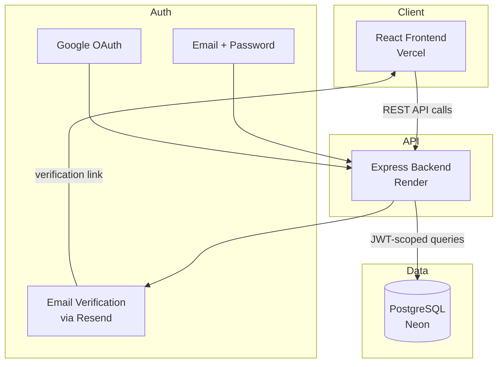

# Fieldstone CRM

A multi-tenant CRM built to be sold or provided to other companies — each business that signs up gets its own fully isolated workspace inside a single shared deployment. Live at:

- **App:** https://claude-crm-project.vercel.app
- **API:** https://claude-crm-project.onrender.com

## Features

- **Contacts** — with a detail view showing full activity history
- **Companies** — linked to contacts and deals
- **Deals pipeline** — drag-and-drop kanban board across New → Contacted → Qualified → Proposal → Won/Lost, with live totals per stage
- **Activity timeline** — notes, calls, emails, and tasks logged against any contact
- **Dashboard** — open pipeline value, won revenue, contact/company counts, upcoming tasks
- **Authentication** — email + password, Google sign-in, and email verification for new accounts
- **Multi-tenancy** — every table is scoped by `organization_id`, so one deployment safely serves many separate companies

## Tech stack

| Layer      | Technology                          |
|------------|--------------------------------------|
| Frontend   | React + Vite, plain CSS design system |
| Backend    | Node.js + Express (REST API)         |
| Database   | PostgreSQL                           |
| Auth       | JWT, bcrypt, Google OAuth 2.0        |
| Email      | Resend (transactional email API)     |
| Hosting    | Vercel (frontend) · Render (backend) · Neon (database) |
| Local dev  | Docker Compose                       |

## Architecture



## Data model

Every business table (`contacts`, `companies`, `deals`, `activities`) carries an `organization_id` foreign key. Every API query filters on the `organization_id` pulled from the authenticated user's JWT — one company's data is structurally unreachable from another company's session, even though they share the same database. This is the standard "shared database, tenant-scoped rows" pattern, and it's what makes offering this as a single product to multiple client companies possible.

## Project structure


## Running it locally

**Requirements:** Docker Desktop.

```bash
cd crm-project
docker compose up --build
```

Open **http://localhost:5173**, click "Create workspace," and sign up.

<details>
<summary>Running without Docker</summary>

You'll need Node.js 20+ and a running PostgreSQL 16 instance.

**Backend:**
```bash
cd backend
npm install
createdb crm
psql crm < db/schema.sql
cp .env.example .env   # fill in DATABASE_URL, JWT_SECRET, etc.
npm run dev
```

**Frontend** (separate terminal):
```bash
cd frontend
npm install
npm run dev
```
</details>

## Environment variables

**Backend**

| Variable | Required | Notes |
|---|---|---|
| `DATABASE_URL` | Yes | Postgres connection string |
| `JWT_SECRET` | Yes | Any long random string |
| `PORT` | No | Defaults to 4000 |
| `GOOGLE_CLIENT_ID` | For Google sign-in | From Google Cloud Console OAuth credentials |
| `RESEND_API_KEY` | For verification emails | From resend.com — without it, signup still works but no email is sent |
| `EMAIL_FROM` | No | Defaults to Resend's onboarding sender |
| `APP_URL` | For email verification links | Your frontend's public URL |

**Frontend**

| Variable | Required | Notes |
|---|---|---|
| `VITE_API_URL` | Yes | Your backend's public URL |
| `VITE_GOOGLE_CLIENT_ID` | For Google sign-in | Same Google Client ID as the backend |

## Deployment

Currently deployed as:
- **Frontend** → Vercel, root directory `crm-project/frontend`
- **Backend** → Render (Docker), root directory `crm-project/backend`
- **Database** → Neon (serverless Postgres, free tier)

If you fork this: set the environment variables above on each platform, and run `backend/db/schema.sql` once against a fresh database (or `backend/db/migrations/` files in order against an existing one).

## Roadmap

- [ ] AI assistant layer — contact summarization, deal scoring, drafting follow-ups
- [ ] Role-based permissions beyond admin/member
- [ ] Rate limiting on auth endpoints
- [ ] Custom domain


